# 🛠️ Aletheia – The Lab of Truth

> Decentralized, open-source platform for scientific exploration and experimentation.

---

## ⚡ Mission
- Collect, catalog, and analyze experimental data  
- Enable modular simulations and scientific workflows  
- Support decentralized collaboration via P2P network

---

## 🧩 Core Projects

| Project | Purpose |
|---------|---------|
| **Aletheia Core** | Data catalog, analysis engine, extensible API |
| **Aletheia CLI** | Command-line tools for interacting with Core |
| **Aletheia Simulations** | Physics-based simulations and modeling |
| **Aletheia P2P** | Decentralized collaboration and compute sharing |

---

## 🚀 Why Aletheia?
- Open-source and modular  
- Designed for scientists, researchers, and hackers  
- High-performance [Rust](https://www.rust-lang.org/)
 backend  
- Future-ready for decentralized workflows

---

## 💡 Get Involved
- Browse repositories and contribute issues or pull requests  
- Star ⭐ projects to support development  
- Share experiments, analysis modules, or simulations  

---

## 🧩 Project Architecture

```mermaid
flowchart TD
    CORE[Aletheia Core<br/>📊 Data Catalog + API<br/>🔬 Analysis Engine]

    CLI[Aletheia CLI<br/>💻 Terminal Tools<br/>for Core API]
    SIM[Aletheia Simulations<br/>🧪 Physics & Modeling<br/>Scientific Workflows]
    P2P[Aletheia P2P<br/>🌐 Decentralized Collaboration<br/>Compute Sharing]

    UI[User Interfaces<br/>📒 Notebooks, Docs, Wiki, UI]

    CORE --> CLI
    CORE --> SIM
    CORE --> P2P

    CLI --> UI
    SIM --> UI
    P2P --> UI
```

---

## 🔗 Links
- [Aletheia Core](https://github.com/Ergasterion-Aletheias/aletheia-core)  
- [Aletheia CLI](https://github.com/Ergasterion-Aletheias/aletheia-cli)  
- [Aletheia Simulations](https://github.com/Ergasterion-Aletheias/aletheia-simulations)  
- [Aletheia P2P](https://github.com/Ergasterion-Aletheias/aletheia-p2p)  
- [Wiki & Documentation](https://github.com/Ergasterion-Aletheias/aletheia-core/wiki)
